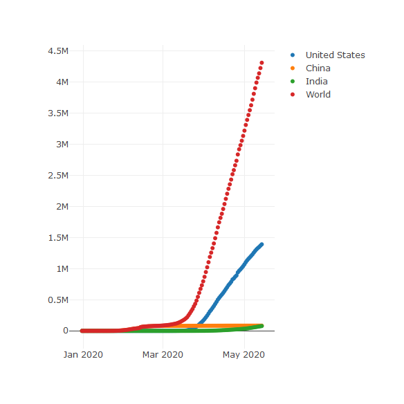

## Slide with R Output

- Select as many number of countries. To delete just select and hit "Delete".  
  The app updates itself to give you the number of Corona Cases in those countries in a chronological order.


```
          date China United.States India  Iran  Spain  Italy
95  2020-04-03 82465        245540  2301 50468 126535 115242
96  2020-04-04 82527        277965  2902 50468 133198 119827
97  2020-04-05 82575        312237  3374 55743 138731 124632
98  2020-04-06 82642        337635  4067 58226 142398 128948
99  2020-04-07 82698        368196  4421 60500 147607 132547
100 2020-04-08 82784        398809  5194 62589 153190 135586
```

--- &twocol

## Features of the Corona Cases App

*** =left

- One stop tool to monitor Corona progression.

- Select upto 210 Countries. 
  View how Corona has progressed in each country.

- Compare the number and growth of Corona cases among countries 

*** =right


--- &twocol

## Interactive Plot to compare Corona cases across countries

*** =left

- Interactive Map. Choose as many countries as you want.

- Select and Delete from Alphabetically placed countries

*** =right



---

## Concluding Slide


- Interesting updates coming soon.

  1. Interactive World Map with updated Corona Cases.

  2. Date select feature to choose date range in which you want to view Corona Cases.

  3. Zoom In and Zoom Out to drive roll-up and roll-down of data. 

  **Download the app immediately to stay updated on the Corona epidemic.**
  **What are you waiting for!!**
  
  Here is the link to the app: https://acharyaanupam.shinyapps.io/corona/
